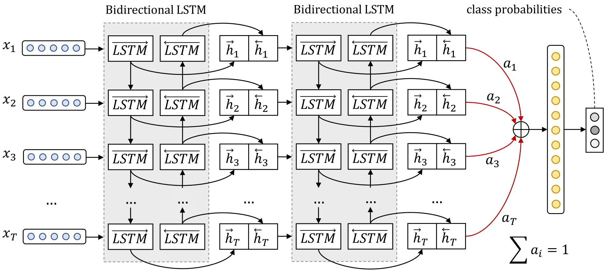
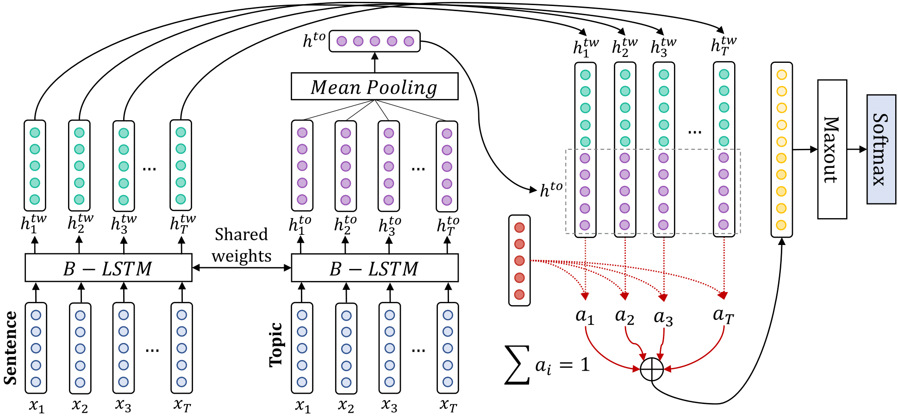

## Overview
This repository contains the source code for the models used for _DataStories_ team's submission
for [SemEval-2017 Task 4 “Sentiment Analysis in Twitter”](http://alt.qcri.org/semeval2017/task4/).
The model is described in the paper 
["DataStories at SemEval-2017 Task 4: Deep LSTM with Attention for Message-level and Topic-based Sentiment Analysis"](http://nlp.arizona.edu/SemEval-2017/pdf/SemEval126.pdf).

Citation:
```
@InProceedings{baziotis-pelekis-doulkeridis:2017:SemEval2,
  author    = {Baziotis, Christos  and  Pelekis, Nikos  and  Doulkeridis, Christos},
  title     = {DataStories at SemEval-2017 Task 4: Deep LSTM with Attention for Message-level and Topic-based Sentiment Analysis},
  booktitle = {Proceedings of the 11th International Workshop on Semantic Evaluation (SemEval-2017)},
  month     = {August},
  year      = {2017},
  address   = {Vancouver, Canada},
  publisher = {Association for Computational Linguistics},
  pages     = {747--754}
}
```


*The message-level sentiment analysis model, for SubTask A.*


*The target-based sentiment analysis model, for SubTasks B,C,D,E.*

**Notes**

* If what you are just interested in the source code for the model then just see 
[models/neural/keras_models.py](https://github.com/cbaziotis/datastories-semeval2017-task4/blob/master/models/neural/keras_models.py).
* The models were trained using Keras 1.2. In order for the project to work with Keras 2 some minor changes will have to be made.


## Prerequisites
#### 1 - Install Requirements
```
pip install -r /datastories-semeval2017-task4/requirements.txt
```

Ubuntu:
```
sudo apt-get install graphviz
```

Windows:
Install graphiz from here:http://www.graphviz.org/Download_windows.php


#### 2 - Download pre-trained Word Embeddings
The models were trained on top of word embeddings pre-trained on a big collection of Twitter messages.
We collected a big dataset of 330M English Twitter messages posted from 12/2012 to 07/2016. 
For training the word embeddings we used [GloVe](https://github.com/stanfordnlp/GloVe).
For preprocessing the tweets we used [ekphrasis](https://github.com/cbaziotis/ekphrasis), 
which is also one of the requirements of this project.

You can download one of the following word embeddings:
- [datastories.twitter.50d.txt](https://mega.nz/#!zsQXmZYI!M_y65hkHdY88iC3I8Yeo7N9IRBI4D9mrpz016fqiXwQ): 50 dimensional embeddings
- [datastories.twitter.100d.txt](https://mega.nz/#!OsYTjIrQ!gLp6YLa0A3ncXjaUffbgL2RtUI74bvSkUKpflAS0OyQ): 100 dimensional embeddings
- [datastories.twitter.200d.txt](https://mega.nz/#!W5BXBISB!Vu19nme_shT3RjVL4Pplu8PuyaRH5M5WaNwTYK4Rxes): 200 dimensional embeddings
- [datastories.twitter.300d.txt](https://mega.nz/#!u4hFAJpK!UeZ5ERYod-SwrekW-qsPSsl-GYwLFQkh06lPTR7K93I): 300 dimensional embeddings

Place the file(s) in `/embeddings` folder, for the program to find it.


## Execution


#### Word Embeddings
In order to specify which word embeddings file you want to use, 
you have to set the values of `WV_CORPUS` and `WV_WV_DIM` in `model_message.py` and `model_target.py` respectively.
The default values are:
```python
WV_CORPUS = "datastories.twitter"
WV_DIM = 300
```

The convention we use to identify each file is:
```
{corpus}.{dimensions}d.txt
```

This means that if you want to use another file, for instance GloVe Twitter word embeddings with 200 dimensions,
you have to place a file like `glove.200d.txt` inside `/embeddings` folder and set:
```python
WV_CORPUS = "glove"
WV_DIM = 200
```


#### Model Training
You will find the programs for training the Keras models, in `/models` folder.
```
models/neural/keras_models
│   keras_models.py  : contains the Keras models
│   model_message.py : script for training the model for Subtask A
│   model_target.py  : script for training the models for Subtask B and D
```